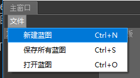
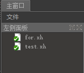
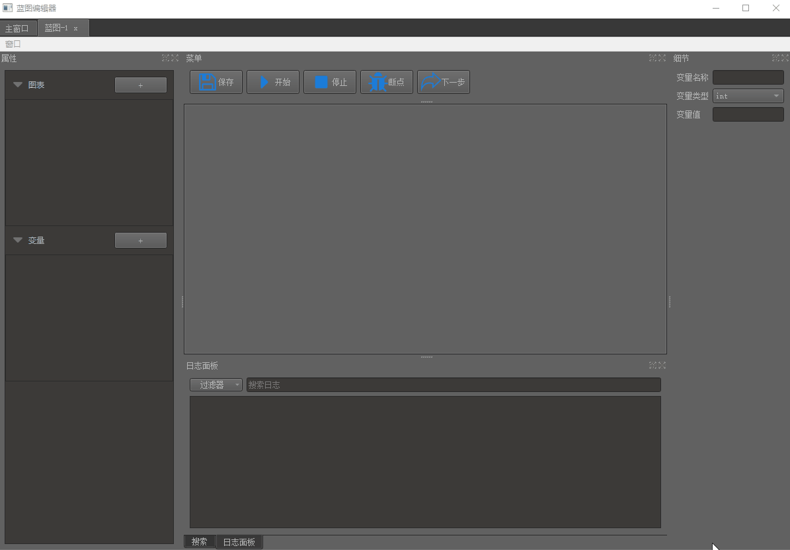
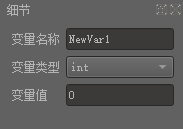
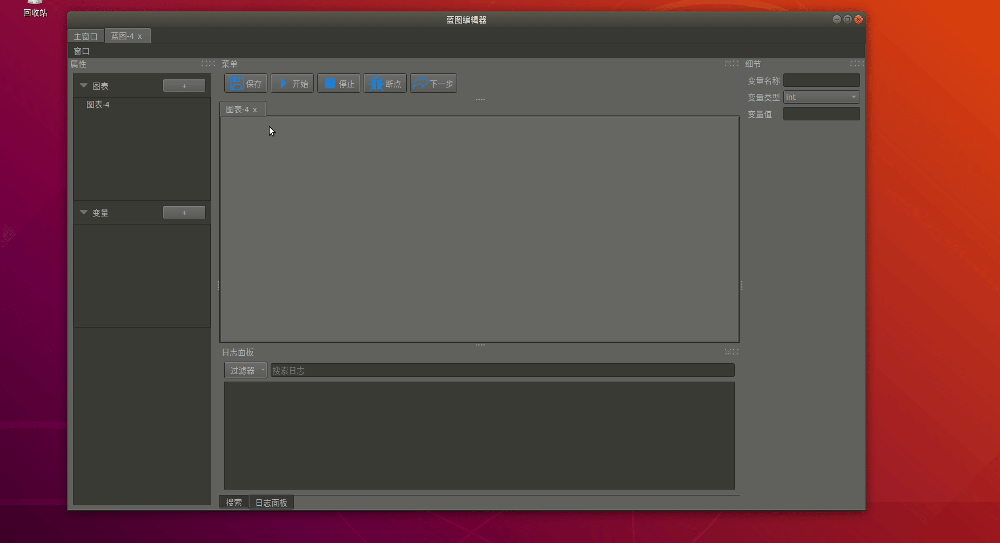
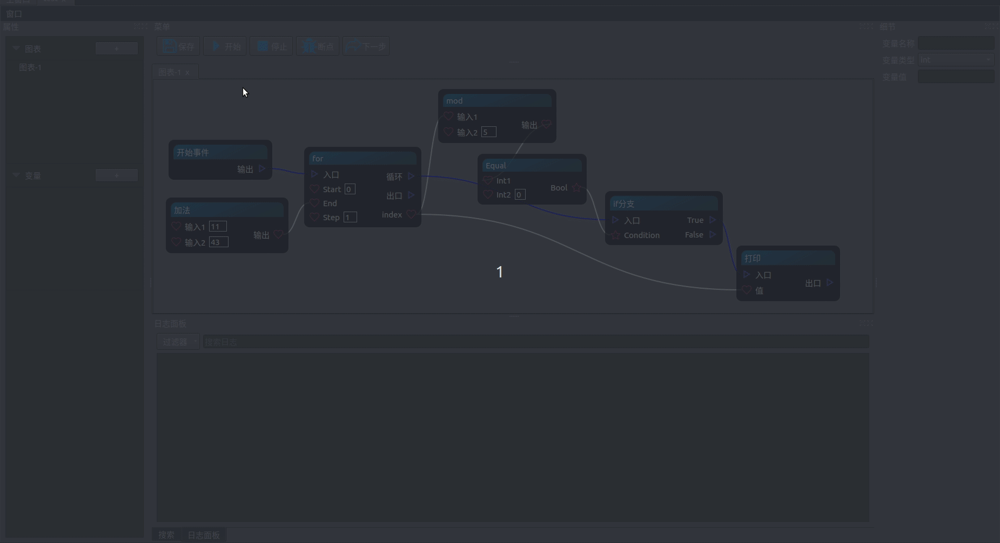
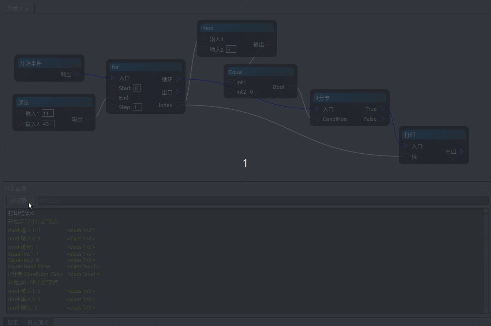

<!--
 * @Description: 
 * @Author: lamborghini1993
 * @Date: 2019-02-22 22:07:42
 * @UpdateDate: 2019-02-22 22:13:30
 -->
<!-- GFM-TOC -->
* [前言介绍](#前言介绍)
* [蓝图操作](#蓝图操作)
    * [一、蓝图新建](#一、蓝图新建)
    * [二、新建图表](#二、新建图表)
    * [三、新建变量](#三、新建变量)
    * [四、节点相关操作](#四、节点相关操作)
    * [五、节点、引脚搜索](#五、节点、引脚搜索)
    * [六、蓝图运行](#六、蓝图运行)
    * [七、日志过滤搜索](#七、日志过滤搜索)
* [数据类型](#数据类型)
<!-- GFM-TOC -->

# 前言介绍
* 在使用UE4蓝图制作游戏过程中，在体会到不用写代码都能设计一款游戏，觉得很强大；
* 自己也积累了很多前端、后端知识，所以准备利用课余时间模仿UE4蓝图做一款编辑器；
* 自己平时用的python比较多，所以准备使用Python3+PyQt5来写；

# 蓝图操作
## 一、蓝图新建
- 新建蓝图（文件-新建蓝图/ctrl+N）

    
- 双击蓝图文件直接打开

     

## 二、新建图表

1. 点击“+”按钮即可新建一个图表。
2. 图表直接操作互不影响。
3. 图表作用：将独立的蓝图可以单独放在一个图表里，结构更清晰。

## 三、新建变量

1. 变量操作新建操作和图表一样。
2. 可以拖拽变量到图表里面，创建Get/Set变量节点，来进行操作。
3. 修改变量值
- 
- 点击变量右侧细节面板可以直接修改类型以及值 

## 四、节点相关操作


1. 新建节点：图表窗口右键空白地方，选着想要建立的节点。
2. 节点拖动：点击节点，然后长按鼠标左键拖动。
3. 蓝图窗口放大/缩小：ctrl+鼠标滑轮滚动。
4. 移动蓝图视口：长按鼠标中间移动。
5. 引脚连线：
    - 流程引脚只能和流程引脚相连；
    - 同类型的数据类型才能相连；
    - 输入引脚只能和输出引脚相连；
    - 输出引脚可以连接多条，输入引脚只能连接一条
6. 删除连线：右键引脚，选择要删除的连线
7. 删除节点：右键节点删除/直接选择节点按del键
    - 删除节点会自动删除相连接的线
8. 节点多选：
    1. ctrl+鼠标左键复选。
    2. 长按鼠标左键拖动进行款选。

## 五、节点、引脚搜索

- 同时支持节点名、引脚名搜索；
- 可切换模块搜索、全匹配搜索；
- 双击搜索树可跳转到对应节点，并选中；

## 六、蓝图运行

- 点击菜单开始/停止按钮即可运行、停止；
- 以上蓝图做了如下逻辑：
```python3
end = 11 + 43
for x in range(0, end, 1):
    if x % 5 == 0:
        print(x)
```
- 运行过的路径使用红色标识


## 七、日志过滤搜索

- 可选过滤种类（依据logging分类）：
    1. 错误
    2. 警告
    3. 消息
    4. 调式
- 可以在搜索框搜索日志关键字进行查找；


# 数据类型

## 数据类型有如下几种：
- 整型
- 浮点型
- 字符串
- 枚举
- vector3
- 多选数据型

## 演示


这里使用一个测试节点，上面绑定了不同类型的数据，来进行演示直接修改引脚默认值
- 多选数据型:可以选择多个值
