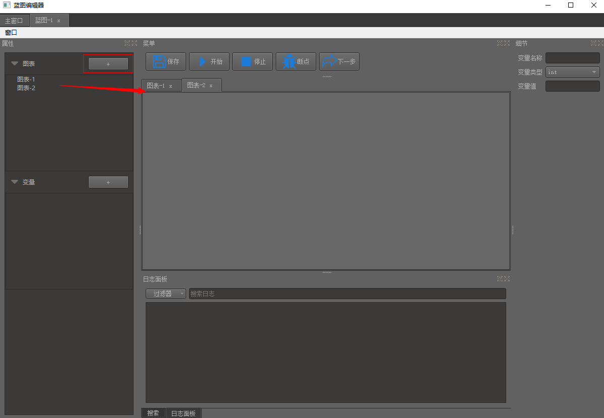

# 前言介绍
* 在使用UE4蓝图制作游戏过程中，在体会到不用写代码都能设计一款游戏，觉得很强大；
* 自己也积累了很多前端、后端知识，所以准备利用课余时间模仿UE4蓝图做一款编辑器；
* 自己平时用的python比较多，所以准备使用Python3+PyQt5来写；

# 相关文档介绍

<!-- - [蓝图操作](./doc/蓝图操作.md)
- [数据类型](./doc/数据类型.md) -->

## 蓝图操作
### 一、蓝图新建

### 二、新建图表

1. 点击“+”按钮即可新建一个图表。
2. 图表直接操作互不影响。
3. 图表作用：将独立的蓝图可以单独放在一个图表里，结构更清晰。

### 三、新建变量

1. 变量操作新建操作和图表一样。
2. 可以拖拽变量到图表里面，创建Get/Set变量节点，来进行操作。
3. 修改变量值
- 
- 点击变量右侧细节面板可以直接修改类型以及值 

### 一、节点相关操作

1. 新建节点：图表窗口右键空白地方，选着想要建立的节点。
2. 节点拖动：点击节点，然后长按鼠标左键拖动。
3. 蓝图窗口放大/缩小：ctrl+鼠标滑轮滚动。
4. 移动蓝图视口：长按鼠标中间移动。
5. 引脚连线：
    - 流程引脚只能和流程引脚相连；
    - 同类型的数据类型才能相连；
    - 输入引脚只能和输出引脚相连；
    - 输出引脚可以连接多条，输入引脚只能连接一条
6. 删除连线：右键引脚，选择要删除的连线
7. 删除节点：右键节点删除/直接选择节点按del键
    - 删除节点会自动删除相连接的线
8. 节点多选：
    1. ctrl+鼠标左键复选。
    2. 长按鼠标左键拖动进行款选。

## 数据类型
### 数据类型有如下几种：
- 整型
- 浮点型
- 字符串
- 枚举
- vector3
- 多选数据型

### 演示

这里使用一个测试节点，上面绑定了不同类型的数据，来进行演示直接修改引脚默认值
- 多选数据型:可以选择多个值
